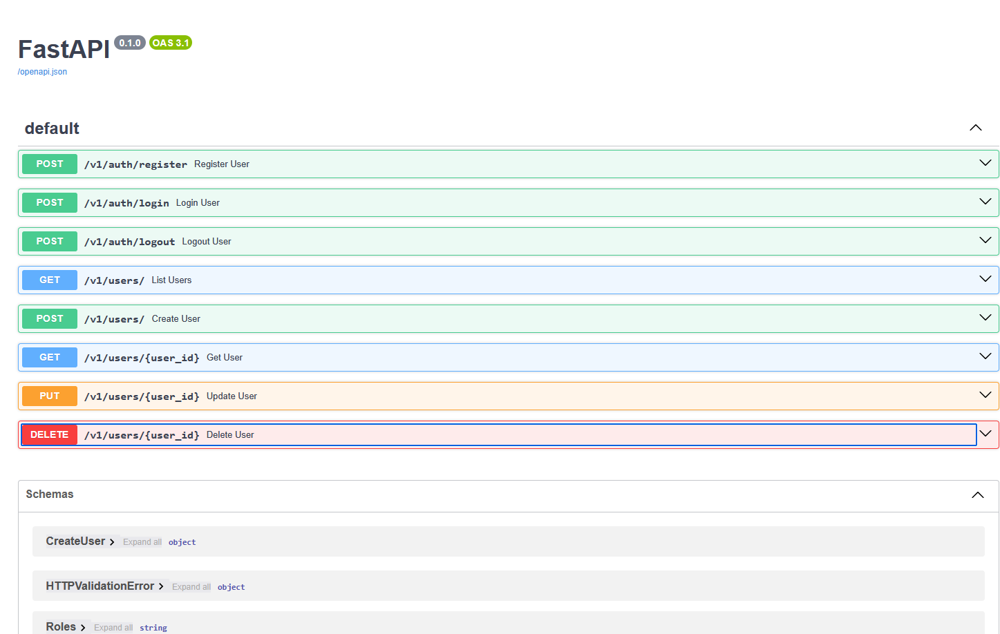

# FastAPI Boilerplate

A production-ready boilerplate built with FastAPI, SQLAlchemy, and Pydantic.

This project already includes:

- JWT authentication & authorization (Not implemented)
- User CRUD endpoints
- PostgreSQL integration
- Async SQLAlchemy setup
- Docker configuration
- Separated API and Database services
- Structured project architecture
- Ready-to-use FastAPI documentation

---

# Features

- FastAPI
- SQLAlchemy (Async)
- Pydantic
- JWT Authentication
- PostgreSQL
- Docker & Docker Compose
- Repository-Service architecture
- Environment variables support
- Swagger/OpenAPI documentation

---

# Project Structure

```bash
.
├── config/                 # Folder with example of dotenv file
│   └── .env.example        # Example dotenv file
├── src/                    # Source folder
│   ├── api/                # API Controllers
│   ├── orm/                # Database layer
│   │   ├── entities/       # SQLAlchemy models/tables
│   │   ├── schemas/        # Pydantic schemas
│   │   ├── repositories/   # Database repositories
│   │   ├── types.py        # Database custom types
│   │   └── config.py       # Database configuration/session
│   ├── services/           # Service-layer
│   └── utils/              # Utils
├── config.py               # Project configuration
├── Dockerfile              # Docker image configuration
├── docker-compose.yml      # Docker services configuration
├── main.py                 # Main app file
└── requirements.txt        # Project dependencies
```

---

# Requirements

- Python 3.11+
- Docker
- Docker Compose
- PostgreSQL

---

# Installation

## 1. Clone repository

```bash
git clone https://github.com/MarryBye/fastapi-boilerplate.git
```

---

## 2. Create environment variables

Copy the ```config/.env.example``` and paste with name like ```.env.dev```
Inside of the file configure values for yourself.

```dotenv
# DATABASE

PG_HOST="your_database_user"
PG_PORT="your_database_password"
POSTGRES_USER="your_database_host"
POSTGRES_PASSWORD="your_database_port"
POSTGRES_DB="your_database_name"

# JWT

JWT_SECRET="your_jwt_secret"
JWT_ALGORITHM="HS256"
JWT_EXPIRATION_MINUTES=120
```

---

## 3. Build and start containers

```bash
docker compose up --build
```

---

# Docker Services

This project contains 2 separated Docker services:

| Service | Description |
|---|---|
| fastapi_app | FastAPI application |
| postgres_db | PostgreSQL database |

---

# API Documentation

FastAPI automatically generates Swagger/OpenAPI documentation.

After starting the project:

## Swagger UI

```text
http://localhost:8000/docs
```

## ReDoc

```text
http://localhost:8000/redoc
```

---

# Manual Configuration

Things you may need to configure manually:

- `.env` variables
- JWT secret key
- Database credentials
- CORS settings
- Production Docker settings
- Reverse proxy (NGINX)

---

# Screenshots

## Swagger UI



---

# Future Improvements

- Alembic migrations
- Role-based permissions
- Refresh tokens
- Redis caching
- Celery background tasks
- Unit & integration tests
- CI/CD pipeline
